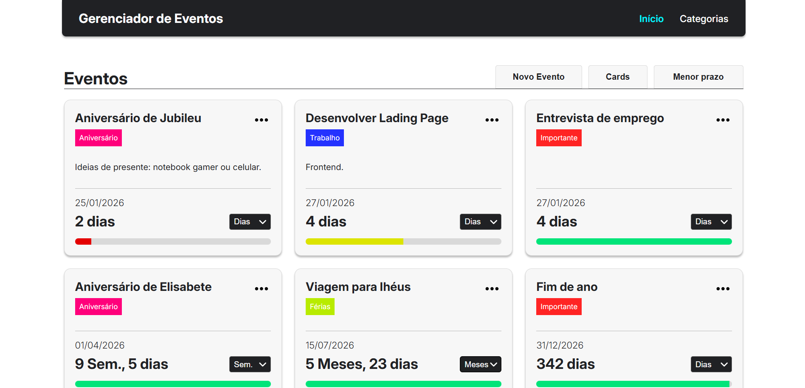

<h1 align="center" >📅 Gerenciador de Eventos 📅</h1>

<!--  -->
<div style="border: 1px solid #ccc; display: inline-block;">
  
</div>

## ℹ️ Sobre
Este projeto é uma **aplicação web desenvolvida em React** para **criação e gerenciamento de eventos**.  
O objetivo foi construir uma solução prática para organização de compromissos e datas importantes, ao mesmo tempo em que foram aplicados conceitos avançados do **ecossistema React**, incluindo arquitetura por features, Context API, hooks personalizados e otimizações de performance.


#### 📍 Acesse o link: https://gerenciador-eventos-swart.vercel.app/

---

## 📋 Funcionalidades

- **Criação de eventos:** o usuário pode cadastrar novos eventos informando:

  - Nome
  - Data de expiração
  - Categoria (opcional)
  - Descrição (opcional)

- **Listagem de eventos:**

  - Visualização em **cards**
  - Visualização em **lista**
  - Pesistência de exibição via LocalStorage

- **Edição de eventos:** eventos cadastrados podem ser editados por meio de modal.

- **Exclusão de eventos:** remoção de eventos já cadastrados.

- **Visualização inteligente de tempo por evento:**
  - Exibição de tempo restante em **dias, semanas ou meses**
  - Alternância dinâmica da unidade de tempo por card
  - **Barra de progresso visual** baseada no tempo decorrido
  - **Cores dinâmicas** na barra conforme o nível de urgência (verde, amarelo, vermelho)


- **Gerenciamento de categorias:**

  - Criação de categorias
  - Listagem de categorias
  - Edição de categorias
  - Remoção de categorias
  - Associação de categorias aos eventos

- **Cálculo automático de tempo:**

  - Dias restantes até o evento
  - Dias decorridos desde a criação
  - Barra de regresso por evento

- **Ordenação de eventos:**
  - Sem ordenação
  - Menor prazo primeiro
  - Maior prazo primeiro
  - Nome (A → Z)
  - Nome (Z → A)

---

## 🛠️ Requisitos Técnicos

- **Validação robusta de formulários com schema**
- **Responsividade:** layout adaptado para diferentes tamanhos de tela.
- **Cálculo dinâmico de datas:** lógica isolada em funções utilitárias.
- **Estado global:** gerenciamento centralizado via Context API.
- **Persistência de dados:** LocalStorage, permitindo operações CRUD persistentes.

---

## 🧠 Arquitetura e Padrões Utilizados

- **Arquitetura baseada em features:**  
  Organização do código por domínio (`events` e `categories`), facilitando manutenção e escalabilidade.

- **Componentização reutilizável:**  
  Componentes compartilhados centralizados em `shared/components`  
  (Button, Input, Modal, Select, ItemMenu, etc.)

- **Separação de responsabilidades:**

  - Lógica de negócio isolada em **hooks personalizados**
  - Estado global encapsulado em **Context Providers**
  - Funções puras em **utils**

- **Composição de componentes:**  
  Uso de um componente base/inteligente (`EventBase`) para alternar dinamicamente entre:

  - `EventCard`
  - `EventRow`

- **CSS Modules:**  
  Estilos escopados por componente, evitando conflitos globais.

---

## ⚛️ Hooks e Recursos do React

### Hooks nativos

- `useState` — gerenciamento de estado local
- `useEffect` — efeitos colaterais e sincronização
- `useMemo` — otimização de valores computados (ex: ordenação)
- `useCallback` — memoização de funções
- `useContext` — estado global compartilhado

### Hooks personalizados

- `useEvents` — gerenciamento completo de eventos (CRUD, regras de negócio)
- `useCategories` — controle e manipulação de categorias
- `useModal` — controle reutilizável de modais

---

### 🧾 Validação de Formulários
- **`React Hook Form`** para gerenciamento performático e otimizado de formulários
- **`Zod`** para validação declarativa e segura baseada em schema
- **Benefícios:**

  - Validação tipada e centralizada
  - Mensagens de erro controladas
  - Melhor performance (menos re-renderizações)
  - Código mais previsível e escalável

---

## 🌐 Gerenciamento de Estado Global

- **Context API** utilizada para:
  - Compartilhamento de eventos
  - Compartilhamento de categorias
- Redução de **prop drilling** através de providers bem definidos
- Uso consciente de props quando o escopo é local e controlado

---

## 🧭 Roteamento e Navegação

- **React Router DOM** para controle de rotas da aplicação
- Uso de:
  - `useSearchParams` para passagem e captura de id via URL, possibilitando a edição correta de evento
- Separação clara entre **páginas** e **componentes**

---

## 🧪 Testes Automatizados

O projeto conta com uma cobertura completa de **testes unitários e de integração** utilizando **Vitest** e **React Testing Library**, garantindo integridade das regras de negócio, validações de formulário e persistência do estado global.

### 🎯 O que é testado:

- **Funções Utilitárias (`date.test.ts`):**
  - Cálculo de dias restantes para datas futuras, presentes e passadas.
  - Regras para anos bissextos e viradas de ano.
  - Tratamento de entradas e datas inválidas.
  - Cálculo da porcentagem de progresso do evento com base no ciclo de vida.

- **Validação de Schemas Zod (`eventSchema.test.ts`):**
  - Validação de payload completo de evento e dados de formulário.
  - Rejeição e tratamento de falhas para datas expiradas ou passadas.

- **Gerenciamento de Eventos (`EventProvider.test.tsx`):**
  - Inicialização com dados padrão e sincronização com `localStorage`.
  - Operações completas de **CRUD** de eventos via hook `useEvents`.
  - Persistência contínua do estado no armazenamento local.

- **Gerenciamento de Categorias (`CategoryProvider.test.tsx`):**
  - Inicialização e busca individual por ID via `getCategory`.
  - Operações completas de **CRUD** de categorias (criação, edição e exclusão) via `useCategories`.
  - Persistência e restauração do estado de categorias no `localStorage`.

---

## 📁 Estrutura de Pastas

A aplicação segue uma organização pensada para projetos escaláveis:

```text
src
 ┣ features
 ┃ ┣ categories
 ┃ ┗ events
 ┣ hooks
 ┣ providers
 ┣ shared
 ┃ ┣ components
 ┃ ┗ layout
 ┣ pages
 ┃ ┣ Categories
 ┃ ┗ Events
 ┣ utils
 ┃ ┗ date.js
```

## 🚀 Tecnologias Utilizadas
- **React** (Hooks, Context API)
- **React Hook Form**
- **Zod**
- **React Router DOM**
- **TypeScript**
- **CSS Modules**
- **date-fns**
- **Vitest / Testing Library**
- **Vite**
- **LocalStorage**

---

## 📄 Licença

Este projeto está sob a licença **MIT**.
Consulte o arquivo `LICENSE` para mais informações.
